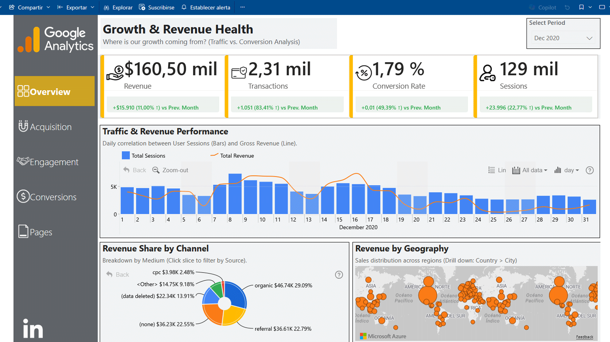
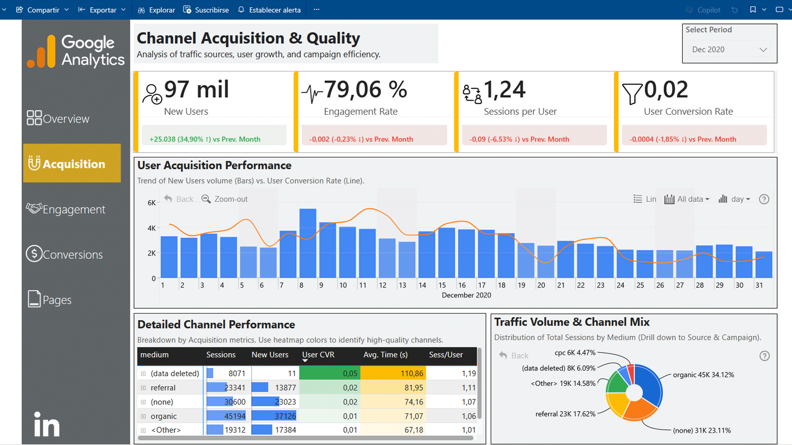
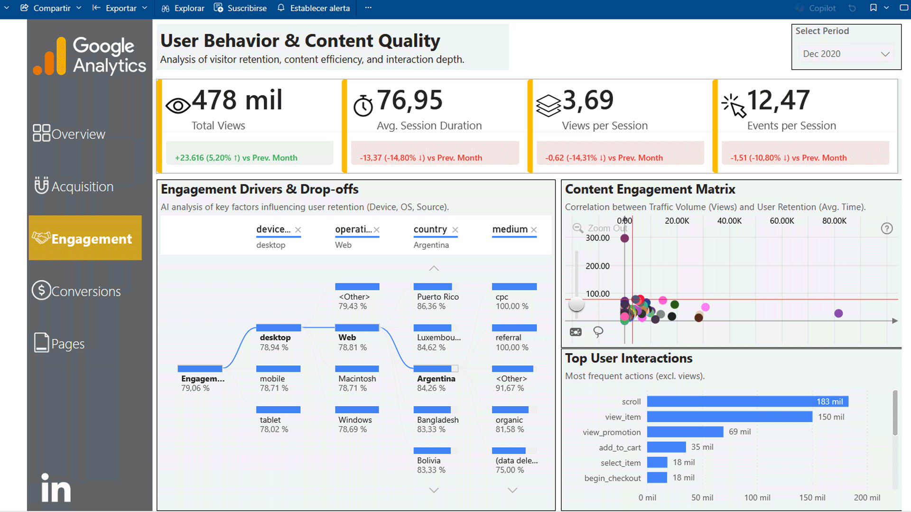
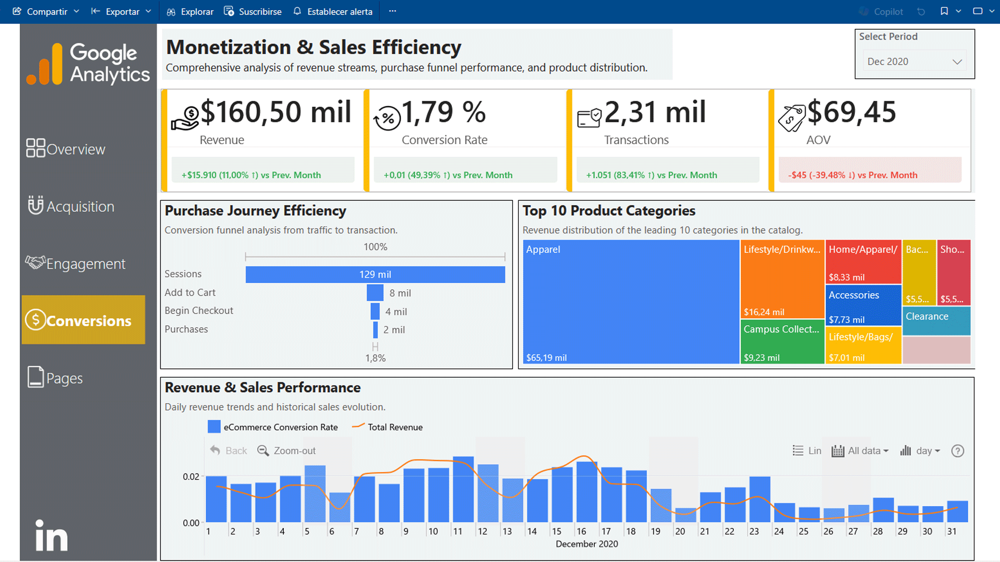

# Google Analytics 4 (GA4) Advanced Dashboard: E-commerce Insights

Este proyecto es una solución de inteligencia de negocios completa (`End-to-End`) que transforma datos crudos de eventos de **Google Analytics 4** en un sistema de toma de decisiones estratégico. 

A diferencia de los conectores estándar, este proyecto utiliza **BigQuery** y **SQL** para modelar los datos granularmente, superando las limitaciones de muestreo y cardinalidad de la interfaz nativa de GA4.

## 📸 Galería del Dashboard

El reporte cuenta con una navegación lateral personalizada y 5 módulos de análisis profundo:

### 1. Visión General (Overview) & Salud del Negocio
Monitorización de KPIs de alto nivel (Ingresos, Transacciones, Tasa de Conversión) y análisis geográfico.

### 2. Adquisición y Calidad de Tráfico
Evaluación de canales de marketing. Incluye matrices de calor para identificar qué fuentes traen usuarios de mayor valor (LTV) y menor rebote.

### 3. Engagement y Comportamiento del Usuario
Análisis de retención y profundidad de la visita.
- **Decomposition Tree:** Para entender los factores clave (Dispositivo, OS, País) que impulsan el engagement.
- **Matriz de Interacción:** Correlación entre volumen de tráfico y tiempo de retención.

### 4. Monetización y Embudos de Conversión
Análisis del *Customer Journey* desde la sesión hasta la compra.
- **Funnel Visual:** Visualización clara de las caídas (drop-offs) entre "Add to Cart", "Begin Checkout" y "Purchase".
- **Product Performance:** Mapa de árbol (Treemap) con las categorías más rentables.

### 5. Rendimiento de Contenido (Pages)
Auditoría de UX analizando qué Landing Pages generan mayor retención y cuáles requieren optimización inmediata.

---

## 🛠️ Arquitectura Técnica

### Extracción y Transformación (ETL)
Los datos se extraen del dataset público `bigquery-public-data.ga4_obfuscated_sample_ecommerce`. Se utilizan scripts SQL optimizados (disponibles en la carpeta `/SQL`) para:
- **Aplanar Arrays:** Desanidar estructuras complejas (`UNNEST`) de `items` y `event_params`.
- **Limpieza:** Estandarización de `source/medium` y conversión de timestamps.

### Modelado de Datos (Star Schema)
El modelo en Power BI abandona la tabla plana única por un esquema de estrella eficiente:
- **Fact Tables:** `Fact_Events`, `Fact_Sales`.
- **Dimension Tables:** `Dim_Products`, `Dim_Date`, `Dim_Geo`.

### Diseño UI/UX Avanzado
- **Navegación tipo App:** Menú lateral estático con estados de selección.
- **KPIs Dinámicos:** Visualizaciones personalizadas (Estilo PayPal) que indican visualmente (Rojo/Verde) el rendimiento vs. el mes anterior sin depender de custom visuals pesados.

## 📂 Estructura del Repositorio

- **`/SQL`**: Consultas de extracción para BigQuery.
- **`/img`**: Recursos gráficos e iconos de la interfaz.
- **`*.pbit`**: Plantilla optimizada del reporte (sin datos cargados).

---
## 👤 Autor
**Juan Manuel Pérez García** *Especialista en Big Data y Análisis de Datos*

